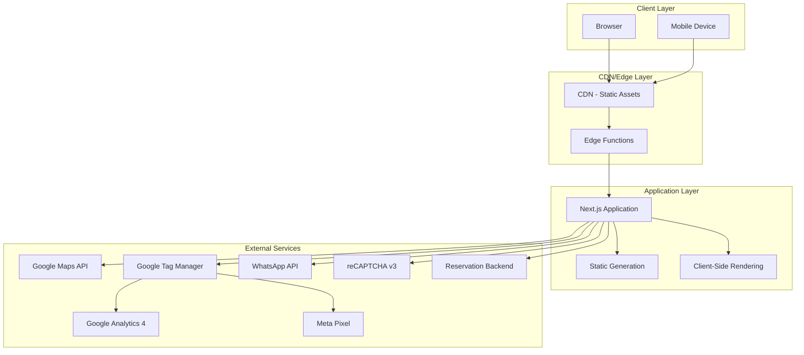
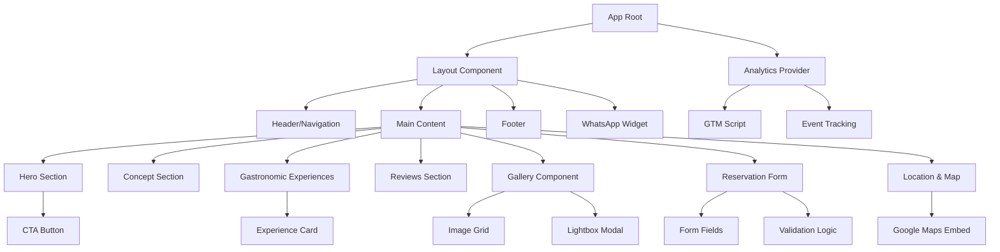
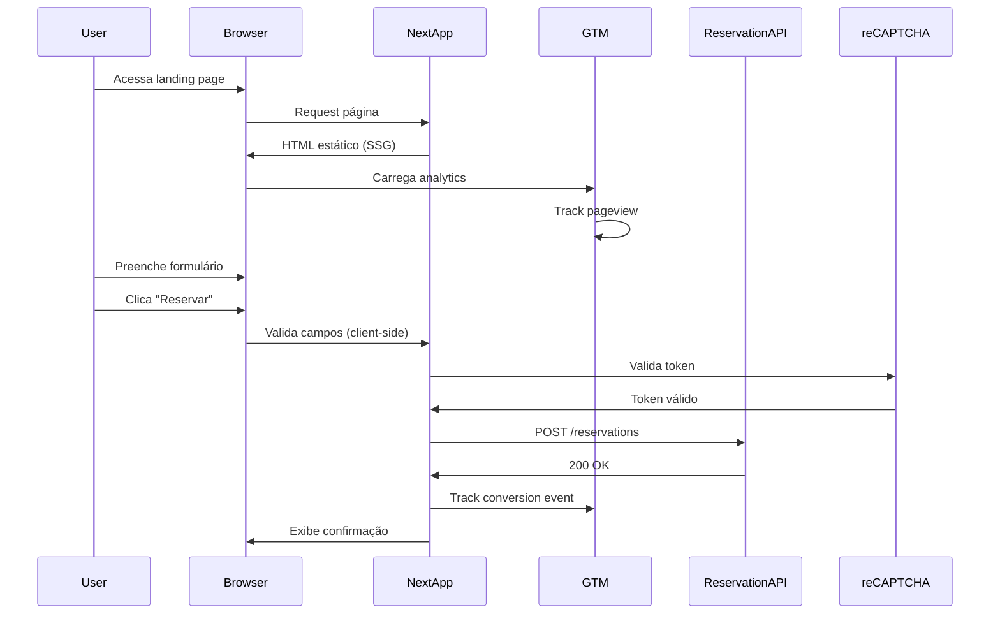

# Design Document: Japanese Restaurant Landing Page

## Overview

Esta landing page é uma aplicação web single-page otimizada para conversão de visitantes em reservas para um restaurante japonês premium. O design prioriza performance, experiência do usuário e SEO, implementando uma arquitetura moderna e escalável.

### Objetivos Principais

- Conversão de visitantes em reservas online
- Posicionamento premium através de design minimalista japonês
- Performance excepcional (PageSpeed 90+, load time <2s)
- Otimização para motores de busca (SEO técnico completo)
- Experiência responsiva perfeita em mobile e desktop

### Stack Tecnológico

**Framework**: Next.js 14+ (App Router)
- Renderização híbrida (SSG para conteúdo estático, CSR para interações)
- Otimização automática de imagens via next/image
- Suporte nativo a Web Vitals e performance
- SEO-friendly com meta tags e sitemap generation

**Styling**: Tailwind CSS 3+
- Design system consistente via configuração centralizada
- Responsive design com mobile-first approach
- Otimização automática de CSS (purge unused styles)

**Form Handling**: React Hook Form + Zod
- Validação type-safe com schemas
- Performance otimizada (uncontrolled components)
- Integração com reCAPTCHA v3

**Analytics**: Google Tag Manager
- Camada de abstração para GA4, Meta Pixel e eventos customizados
- Gerenciamento de tags sem deploy de código

**Deployment**: Vercel / Netlify
- Edge network global para baixa latência
- HTTPS automático
- Cache inteligente e invalidação

## Architecture

### System Architecture



### Component Architecture



### Data Flow



## Components and Interfaces

### Core Components

#### 1. Hero Section Component

**Responsabilidade**: Seção principal acima da dobra com impacto visual e CTAs de conversão.

**Props Interface**:
```typescript
interface HeroSectionProps {
  backgroundMedia: {
    type: 'image' | 'video';
    src: string;
    alt?: string;
    poster?: string; // Para vídeos
  };
  headline: string;
  subheadline?: string;
  ctaButtons: Array<{
    text: string;
    variant: 'primary' | 'secondary';
    action: 'scroll-to-form' | 'whatsapp';
    trackingId: string;
  }>;
}
```

**Comportamento**:
- Mobile: Layout vertical, imagem/vídeo full-width, CTAs empilhados
- Desktop: Layout horizontal com overlay de texto, CTAs lado a lado
- Lazy loading para vídeo background (carrega após imagem poster)

#### 2. Reservation Form Component

**Responsabilidade**: Captura e valida dados de reserva, integra com backend e reCAPTCHA.

**Props Interface**:
```typescript
interface ReservationFormProps {
  onSubmitSuccess: (data: ReservationData) => void;
  onSubmitError: (error: FormError) => void;
  recaptchaSiteKey: string;
}

interface ReservationData {
  name: string;
  phone: string;
  email: string;
  date: string; // ISO 8601 format
  time: string; // HH:mm format
  guests: number;
  recaptchaToken: string;
}

interface FormError {
  field?: string;
  message: string;
  type: 'validation' | 'network' | 'server';
}
```

**Validação Schema (Zod)**:
```typescript
const reservationSchema = z.object({
  name: z.string().min(2, 'Nome deve ter pelo menos 2 caracteres'),
  phone: z.string().regex(/^\+?[1-9]\d{10,14}$/, 'Telefone inválido'),
  email: z.string().email('Email inválido'),
  date: z.string().refine(isValidFutureDate, 'Data deve ser futura'),
  time: z.string().regex(/^([01]\d|2[0-3]):([0-5]\d)$/, 'Horário inválido'),
  guests: z.number().int().min(1).max(20, 'Máximo 20 pessoas'),
});
```

**Estados**:
- `idle`: Formulário pronto para preenchimento
- `validating`: Validando campos client-side
- `submitting`: Enviando para backend
- `success`: Reserva confirmada
- `error`: Erro no envio (exibe mensagem e retry)

#### 3. WhatsApp Widget Component

**Responsabilidade**: Botão flutuante para contato direto via WhatsApp.

**Props Interface**:
```typescript
interface WhatsAppWidgetProps {
  phoneNumber: string; // Formato: +5511999999999
  defaultMessage: string;
  position: 'bottom-right' | 'bottom-left';
  trackingId: string;
}
```

**Comportamento**:
- Fixed position, z-index alto para ficar acima de outros elementos
- Mobile: Abre app WhatsApp nativo
- Desktop: Abre WhatsApp Web
- Tracking de cliques via GTM

#### 4. Gallery Component

**Responsabilidade**: Exibição otimizada de fotos do restaurante com lightbox.

**Props Interface**:
```typescript
interface GalleryProps {
  images: Array<{
    src: string;
    alt: string;
    width: number;
    height: number;
    blurDataURL?: string; // Para placeholder blur
  }>;
  layout: 'masonry' | 'grid';
}
```

**Comportamento**:
- Lazy loading para imagens fora do viewport
- Responsive images (srcset) baseado em viewport
- Lightbox modal ao clicar (navegação com teclado)
- Mobile: 1 coluna, Desktop: 3 colunas

#### 5. Map Component

**Responsabilidade**: Integração com Google Maps para exibir localização.

**Props Interface**:
```typescript
interface MapComponentProps {
  location: {
    lat: number;
    lng: number;
    address: string;
  };
  apiKey: string;
  zoom: number;
  height: string;
}
```

**Comportamento**:
- Lazy loading (carrega ao scroll próximo)
- Click abre Google Maps em nova aba
- Fallback para imagem estática se API falhar

#### 6. Analytics Provider

**Responsabilidade**: Gerenciamento centralizado de tracking e eventos.

**Interface**:
```typescript
interface AnalyticsProvider {
  trackPageView: (path: string) => void;
  trackEvent: (event: AnalyticsEvent) => void;
  trackConversion: (data: ConversionData) => void;
}

interface AnalyticsEvent {
  category: string;
  action: string;
  label?: string;
  value?: number;
}

interface ConversionData {
  type: 'reservation' | 'whatsapp_click' | 'cta_click';
  value?: number;
  metadata?: Record<string, any>;
}
```

### Utility Modules

#### SEO Module

**Responsabilidade**: Geração de meta tags, schema markup e sitemap.

```typescript
interface SEOConfig {
  title: string;
  description: string;
  canonicalUrl: string;
  ogImage: string;
  schema: RestaurantSchema;
}

interface RestaurantSchema {
  '@context': 'https://schema.org';
  '@type': 'Restaurant';
  name: string;
  address: PostalAddress;
  telephone: string;
  openingHours: string[];
  priceRange: string;
  servesCuisine: string[];
  image: string[];
}
```

#### Media Loader

**Responsabilidade**: Otimização e carregamento de imagens/vídeos.

```typescript
interface MediaLoaderConfig {
  formats: ['webp', 'avif', 'jpg'];
  sizes: {
    mobile: number;
    tablet: number;
    desktop: number;
  };
  quality: number;
  lazyLoad: boolean;
}
```

## Data Models

### Configuration Data Model

Arquivo centralizado para conteúdo e configurações (`config/site.json`):

```typescript
interface SiteConfig {
  restaurant: {
    name: string;
    tagline: string;
    phone: string;
    whatsappNumber: string;
    email: string;
    address: {
      street: string;
      city: string;
      state: string;
      zipCode: string;
      country: string;
      coordinates: { lat: number; lng: number };
    };
    openingHours: Array<{
      dayOfWeek: string;
      opens: string;
      closes: string;
    }>;
    priceRange: string;
  };
  
  content: {
    hero: {
      headline: string;
      subheadline: string;
      backgroundMedia: MediaAsset;
    };
    concept: {
      title: string;
      description: string;
      image: MediaAsset;
    };
    experiences: Array<{
      id: string;
      title: string;
      description: string;
      image: MediaAsset;
    }>;
    reviews: Array<{
      id: string;
      author: string;
      rating: number;
      text: string;
      date?: string;
    }>;
    gallery: Array<MediaAsset>;
  };
  
  seo: {
    title: string;
    description: string;
    keywords: string[];
    ogImage: string;
  };
  
  integrations: {
    googleMapsApiKey: string;
    googleAnalyticsId: string;
    gtmId: string;
    metaPixelId: string;
    recaptchaSiteKey: string;
  };
}

interface MediaAsset {
  src: string;
  alt: string;
  width: number;
  height: number;
  blurDataURL?: string;
}
```

### Form State Model

```typescript
interface FormState {
  values: ReservationData;
  errors: Record<string, string>;
  touched: Record<string, boolean>;
  isSubmitting: boolean;
  submitStatus: 'idle' | 'success' | 'error';
  submitError?: FormError;
}
```

### Analytics Event Model

```typescript
type AnalyticsEventType =
  | 'page_view'
  | 'cta_click'
  | 'form_start'
  | 'form_submit'
  | 'form_success'
  | 'form_error'
  | 'whatsapp_click'
  | 'gallery_image_click'
  | 'map_click'
  | 'navigation_click';

interface TrackedEvent {
  type: AnalyticsEventType;
  timestamp: number;
  metadata: Record<string, any>;
}
```


## Correctness Properties

*A property is a characteristic or behavior that should hold true across all valid executions of a system-essentially, a formal statement about what the system should do. Properties serve as the bridge between human-readable specifications and machine-verifiable correctness guarantees.*

### Property 1: Hero Section CTA Minimum Count

*For any* Hero Section configuration, the rendered component should display at least two CTA buttons.

**Validates: Requirements 1.3**

### Property 2: Form Field Validation on Submission

*For any* form submission attempt, all required fields (name, phone, email, date, time, guests) should be validated before submission is allowed.

**Validates: Requirements 3.2, 17.4**

### Property 3: Valid Data Submission

*For any* valid reservation data (passing all validation rules), the form should successfully submit the data to the backend service.

**Validates: Requirements 3.3**

### Property 4: Invalid Field Error Display

*For any* invalid field in the reservation form, a specific error message should be displayed indicating the validation failure.

**Validates: Requirements 3.4**

### Property 5: Schema Completeness

*For any* restaurant configuration, the generated JSON-LD schema should include all required fields: name, address, phone, opening hours, and price range.

**Validates: Requirements 5.4**

### Property 6: Image Alt Attribute Presence

*For any* image rendered on the landing page, an alt attribute should be present (even if empty for decorative images).

**Validates: Requirements 5.6**

### Property 7: Below-Fold Image Lazy Loading

*For any* image positioned below the fold (outside initial viewport), lazy loading should be applied to defer loading until the image approaches the viewport.

**Validates: Requirements 6.3**

### Property 8: Modern Image Format Serving

*For any* image served by the Media Loader, the format should be WebP or AVIF (with appropriate fallbacks for browser compatibility).

**Validates: Requirements 6.4**

### Property 9: Touch Target Minimum Size

*For any* interactive element (buttons, links, form inputs), the touch target size should be at least 44x44 pixels to ensure mobile usability.

**Validates: Requirements 7.3**

### Property 10: CTA Click Tracking

*For any* CTA button click event, an analytics tracking event should be fired to the Analytics Module.

**Validates: Requirements 8.5**

### Property 11: Testimonial Author Display

*For any* testimonial displayed in the Review Section, the reviewer's name should be included in the rendered output.

**Validates: Requirements 10.3**

### Property 12: CTA Scroll Behavior

*For any* CTA button with scroll-to-form action, clicking the button should trigger smooth scrolling to the Reservation Form section.

**Validates: Requirements 13.5**

### Property 13: Gallery Image Lazy Loading

*For any* image in the Gallery Component, lazy loading should be implemented to optimize initial page load performance.

**Validates: Requirements 14.2**

### Property 14: Gallery Lightbox Interaction

*For any* gallery image click event, the image should open in a full-screen lightbox modal view.

**Validates: Requirements 14.3**

### Property 15: Responsive Image Serving

*For any* viewport size, the Gallery Component should serve appropriately sized images using responsive image techniques (srcset/sizes).

**Validates: Requirements 14.4**

### Property 16: Navigation Link Completeness

*For any* main content section on the landing page, a corresponding navigation link should exist in the header navigation.

**Validates: Requirements 16.2**

### Property 17: Navigation Smooth Scroll

*For any* navigation link click event, the page should smooth-scroll to the corresponding section.

**Validates: Requirements 16.3**

### Property 18: Interactive Element ARIA Labels

*For any* interactive element (buttons, form inputs, links), appropriate ARIA labels or attributes should be present for screen reader accessibility.

**Validates: Requirements 18.1**

### Property 19: Keyboard Navigation Support

*For any* interactive element, keyboard navigation (Tab, Enter, Space) should be fully functional without requiring mouse interaction.

**Validates: Requirements 18.2**

### Property 20: Text Color Contrast Compliance

*For any* text element on the landing page, the color contrast ratio between text and background should be at least 4.5:1 to meet WCAG AA standards.

**Validates: Requirements 18.3**

### Property 21: Focus Indicator Visibility

*For any* focusable element that receives keyboard focus, a visible focus indicator should be displayed to aid keyboard navigation.

**Validates: Requirements 18.5**

## Error Handling

### Form Submission Errors

**Network Errors**:
- Detect network failures using try-catch on fetch/axios calls
- Display user-friendly message: "Não foi possível conectar ao servidor. Verifique sua conexão e tente novamente."
- Provide retry button that re-attempts submission with same data
- Log error to console for debugging (development only)

**Server Errors (4xx/5xx)**:
- Parse error response for specific error messages
- Display server-provided message if available, otherwise generic message
- For 400 Bad Request: Display field-specific validation errors
- For 500 Internal Server Error: "Ocorreu um erro no servidor. Por favor, tente novamente em alguns minutos."
- Provide retry option with exponential backoff

**Validation Errors**:
- Client-side validation runs before submission (Zod schema)
- Display inline error messages below each invalid field
- Prevent form submission until all fields are valid
- Highlight invalid fields with red border and error icon
- Error messages in Portuguese, specific to each validation rule

**reCAPTCHA Errors**:
- If reCAPTCHA token generation fails, display: "Falha na verificação de segurança. Recarregue a página e tente novamente."
- Automatically retry token generation once before showing error
- Log reCAPTCHA errors for monitoring

### Media Loading Errors

**Image Load Failures**:
- Implement onError handler for all images
- Display placeholder image or background color on failure
- Log failed image URLs for monitoring
- Gracefully degrade: page remains functional without images

**Video Load Failures** (Hero background):
- Fallback to poster image if video fails to load
- Detect video load errors within 5 seconds
- Continue with static image experience

**Google Maps API Errors**:
- Detect API load failures or quota exceeded errors
- Fallback to static map image with link to Google Maps
- Display address text even if map fails
- Log API errors for monitoring

### Analytics Errors

**GTM/GA4 Load Failures**:
- Wrap analytics calls in try-catch to prevent page breakage
- Silently fail if analytics scripts don't load (ad blockers)
- Queue events and retry if GTM loads late
- Never block user interactions due to analytics failures

### Third-Party Integration Errors

**WhatsApp API**:
- Detect if WhatsApp app/web is unavailable
- Fallback to displaying phone number for manual contact
- Handle mobile vs desktop differences gracefully

**reCAPTCHA v3**:
- Timeout after 10 seconds if reCAPTCHA doesn't load
- Allow form submission with server-side validation only
- Log reCAPTCHA availability issues

### Error Monitoring Strategy

- Implement error boundary components (React Error Boundaries)
- Log errors to monitoring service (Sentry, LogRocket, or similar)
- Track error rates in analytics
- Set up alerts for critical errors (form submission failures >5%)
- Include user context in error logs (viewport, browser, timestamp)

## Testing Strategy

### Unit Testing

**Framework**: Jest + React Testing Library

**Focus Areas**:
- Component rendering with various props configurations
- Form validation logic (Zod schemas)
- Utility functions (date formatting, phone validation, etc.)
- Error state handling
- Accessibility attributes presence

**Example Unit Tests**:
- Hero Section renders with required elements
- Reservation Form displays all input fields
- Form validation rejects invalid email formats
- WhatsApp Widget generates correct WhatsApp URL
- SEO Module generates complete meta tags
- Gallery Component renders minimum 6 images
- Navigation links match content sections

**Edge Cases to Test**:
- Empty form submission attempts
- Invalid date/time combinations (past dates, closed hours)
- Phone numbers in various formats
- Email addresses with special characters
- Very long names or messages
- Missing configuration values (graceful degradation)

### Property-Based Testing

**Framework**: fast-check (JavaScript/TypeScript property-based testing library)

**Configuration**: Minimum 100 iterations per property test to ensure comprehensive input coverage

**Property Test Implementation**:

Each property test must include a comment tag referencing the design document property:

```typescript
// Feature: japanese-restaurant-landing-page, Property 1: Hero Section CTA Minimum Count
test('Hero Section displays at least two CTA buttons', () => {
  fc.assert(
    fc.property(
      heroConfigArbitrary,
      (config) => {
        const { container } = render(<HeroSection {...config} />);
        const ctaButtons = container.querySelectorAll('[data-testid="cta-button"]');
        expect(ctaButtons.length).toBeGreaterThanOrEqual(2);
      }
    ),
    { numRuns: 100 }
  );
});
```

**Generators (Arbitraries)**:

```typescript
// Reservation data generator
const reservationDataArbitrary = fc.record({
  name: fc.string({ minLength: 2, maxLength: 100 }),
  phone: fc.string().filter(isValidPhone),
  email: fc.emailAddress(),
  date: fc.date({ min: new Date() }).map(d => d.toISOString().split('T')[0]),
  time: fc.integer({ min: 0, max: 23 }).chain(h =>
    fc.integer({ min: 0, max: 59 }).map(m => 
      `${h.toString().padStart(2, '0')}:${m.toString().padStart(2, '0')}`
    )
  ),
  guests: fc.integer({ min: 1, max: 20 }),
});

// Invalid field data generator
const invalidFieldArbitrary = fc.oneof(
  fc.constant(''), // empty string
  fc.string({ maxLength: 1 }), // too short
  fc.constant('   '), // whitespace only
);

// Image configuration generator
const imageConfigArbitrary = fc.record({
  src: fc.webUrl(),
  alt: fc.string(),
  width: fc.integer({ min: 100, max: 4000 }),
  height: fc.integer({ min: 100, max: 4000 }),
});
```

**Property Tests to Implement**:

1. **Property 2**: Form validation runs on all required fields for any submission
2. **Property 3**: Valid reservation data always submits successfully (mock backend)
3. **Property 4**: Invalid fields always display error messages
4. **Property 5**: Generated schema always includes all required fields
5. **Property 6**: All images have alt attributes
6. **Property 7**: Below-fold images have lazy loading attribute
7. **Property 8**: Served images are in WebP/AVIF format
8. **Property 9**: Interactive elements meet minimum touch target size
9. **Property 10**: CTA clicks always fire analytics events
10. **Property 11**: Testimonials always include author names
11. **Property 12**: CTA clicks trigger scroll to form
12. **Property 13**: Gallery images have lazy loading
13. **Property 14**: Gallery image clicks open lightbox
14. **Property 15**: Responsive images use srcset
15. **Property 16**: All sections have navigation links
16. **Property 17**: Navigation clicks trigger smooth scroll
17. **Property 18**: Interactive elements have ARIA labels
18. **Property 19**: Interactive elements support keyboard navigation
19. **Property 20**: Text meets contrast ratio requirements
20. **Property 21**: Focused elements show visible indicators

### Integration Testing

**Framework**: Playwright or Cypress

**Focus Areas**:
- End-to-end user flows (visitor to reservation submission)
- Third-party integrations (Google Maps, WhatsApp, Analytics)
- Responsive behavior across actual devices
- Form submission to real/staging backend
- Analytics event firing verification

**Critical User Flows**:
1. Landing → Scroll → Fill Form → Submit → Confirmation
2. Landing → Click WhatsApp → Opens WhatsApp
3. Landing → Click Gallery Image → Lightbox Opens → Navigate → Close
4. Landing → Click Navigation Link → Scrolls to Section
5. Landing → Mobile Menu → Navigate → Section Visible

### Performance Testing

**Tools**: Lighthouse CI, WebPageTest

**Metrics to Monitor**:
- PageSpeed Score (target: 90+)
- First Contentful Paint (target: <1.5s)
- Largest Contentful Paint (target: <2.5s)
- Time to Interactive (target: <3.5s)
- Cumulative Layout Shift (target: <0.1)
- Total Blocking Time (target: <300ms)

**Performance Budgets**:
- Total page size: <2MB
- JavaScript bundle: <300KB (gzipped)
- CSS bundle: <50KB (gzipped)
- Images: WebP/AVIF with appropriate compression
- Fonts: Subset and preload critical fonts

### Accessibility Testing

**Tools**: axe-core, WAVE, Lighthouse Accessibility Audit

**Manual Testing**:
- Keyboard-only navigation through entire page
- Screen reader testing (NVDA/JAWS on Windows, VoiceOver on macOS/iOS)
- Color contrast verification
- Focus management testing
- ARIA attribute validation

### Visual Regression Testing

**Tool**: Percy or Chromatic

**Scenarios**:
- Desktop viewport (1920x1080, 1366x768)
- Mobile viewport (375x667, 414x896)
- Tablet viewport (768x1024)
- Component states (hover, focus, error, loading)
- Dark mode (if implemented)

### Testing Checklist Before Deployment

- [ ] All unit tests passing (100% of critical paths)
- [ ] All property tests passing (100 iterations each)
- [ ] Integration tests passing on staging environment
- [ ] Lighthouse score ≥90 on mobile and desktop
- [ ] Accessibility audit passing (0 critical issues)
- [ ] Cross-browser testing completed (Chrome, Firefox, Safari, Edge)
- [ ] Mobile device testing on real devices (iOS, Android)
- [ ] Form submission tested with real backend
- [ ] Analytics events verified in GTM preview mode
- [ ] SEO meta tags validated
- [ ] Schema markup validated (Google Rich Results Test)
- [ ] Visual regression tests reviewed and approved

